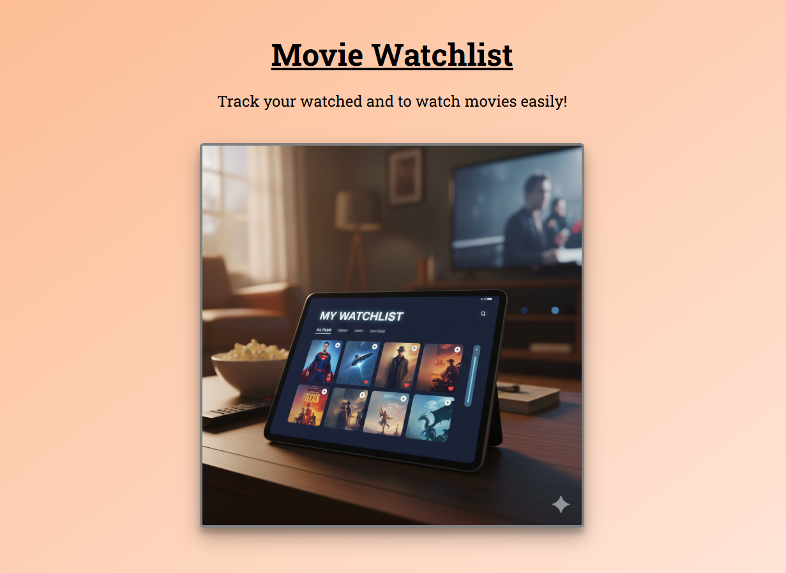
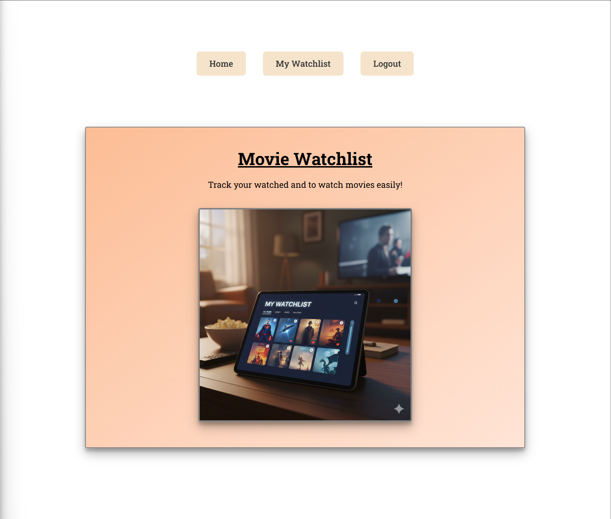
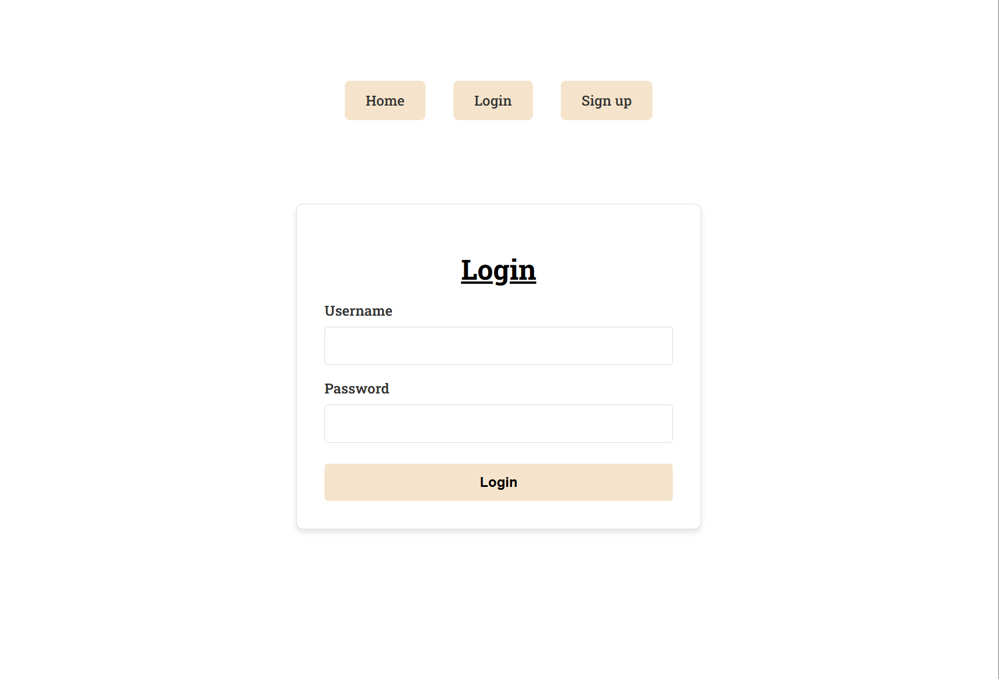
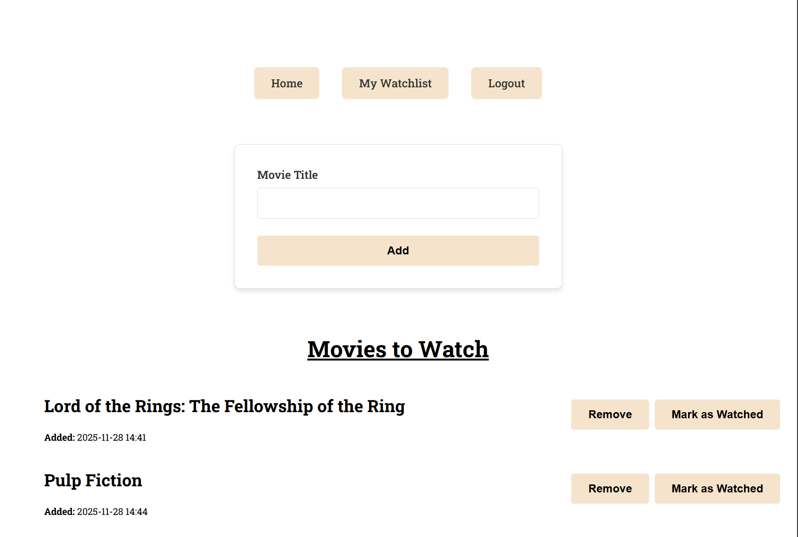
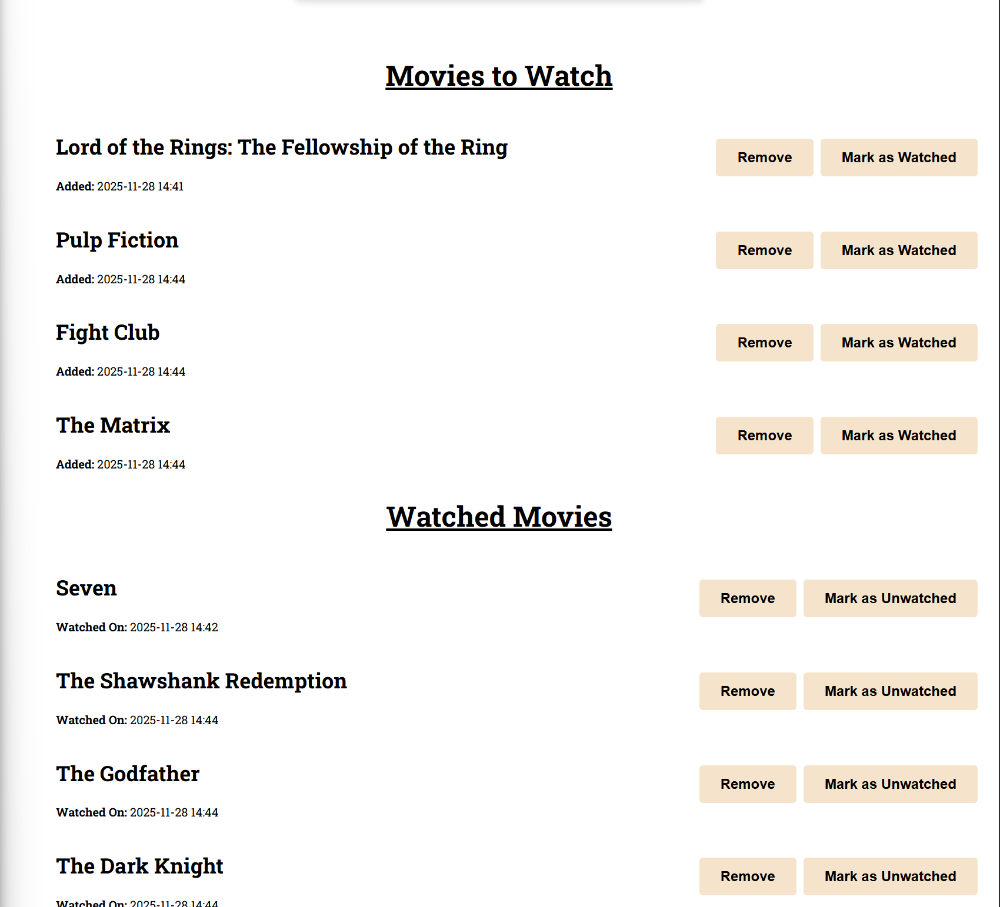

# 🎬 Movie Watchlist

> **A simple web-based movie watchlist app built with Python, Flask, and Bootstrap.**

---

	

---

	
	
	
	
	
	

---

## 📑 Table of Contents

1. [Introduction](#-introduction)
2. [Tech Stack](#-tech-stack)
3. [Features](#-features)
4. [Screenshots](#-screenshots)
5. [Demo](#-demo)
6. [About](#-about)

---

## 🚀 Introduction

Movie Watchlist is a web application for tracking movies you want to watch. Built with Python and Flask, it offers a clean, user-friendly interface for adding, viewing, and managing your personal movie list. This project is a learning exercise in backend development, authentication, and web design using Flask and modern tools.

---

## 🛠️ Tech Stack

- **Python 3.11** – Core programming language
- **Flask 2.3** – Web framework
- **Flask-Login, Flask-WTF, Flask-Bcrypt** – Authentication, forms, and password hashing
- **SQLAlchemy** – ORM and database access
- **Flask-Migrate** – Database migrations
- **PostgreSQL (Neon)** – Cloud database

---

## ✨ Features

- 🎬 **Movie Management:** Add, delete, and list movies
- 👤 **User Authentication:** Register, login, and manage users
- 🔒 **Secure Authentication:** Password hashing and session management
- 🗄️ **Cloud Database:** Persistent storage with PostgreSQL (Neon)

---

## 🖼️ Screenshots

<table align="center">
	<tr>
		<td align="center"><b>Home Page</b> 
			
		</td>
		<td align="center"><b>Login</b> 
			
		</td>
	</tr>
	<tr>
		<td align="center"><b>Add Movie</b> 
			
		</td>
		<td align="center"><b>Watchlist</b> 
			
		</td>
	</tr>
</table>

---

## 🚀 Demo

This project is live:

[🌐 Demo Now](https://movie-watchlist-4yrs.onrender.com/)

> _Please note: The Render server may take a few minutes to start up if it has been idle._

---

## 👤 About

Created by **Michael Pinsonneault**

- [Portfolio](https://portfolio-michael-pinsonneault.onrender.com)
- [GitHub](https://github.com/Mikepin23)
- [LinkedIn](https://www.linkedin.com/in/michael-pinsonneault)

> Thank you for checking out my project!
